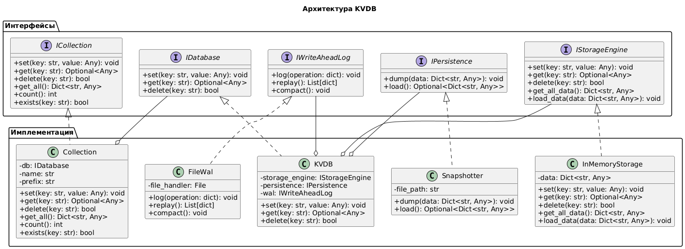

# Выполнение лабораторных работ по Инфраструктуре больших данных

## ЛР 1. Скелет программы



In-memory Key-Value хранилища данных на Python. В основе лежит использование хэш-таблицы (dict). Персистентность обеспечиватется переодическими снапшотами и WAL.

## ЛР 2. Работающая KVDB

### Настройка окружения
1. Установить uv. Документация по установке [здесь](https://docs.astral.sh/uv/getting-started/installation/)
2. Из репозитория выполнить команду `uv sync`
3. Запуск `uv run <python_file.py>`

### Реализованные интерфейсы

1. **IStorageEngine** → [InMemoryStorage](app/core/storage.py)
2. **IPersistence** → [Snapshotter](app/core/persistence.py)
3. **IWriteAheadLog** → [FileWal](app/core/wal.py)
4. **IDatabase** → [KVDB](app/core/database.py)

Новый интерфейс ICollection:
Позволяет организовывать независимые коллекции с помощью добавления префикса `<название_коллекции>:` к ключу

**ICollection** → [Collection](app/core/collection.py)

### Пример использования

```python
from app.core import KVDB
from app.core.storage import InMemoryStorage
from app.core.persistence import Snapshotter
from app.core.wal import FileWal
from app.core.collection import Collection

# Инициализация базы данных
db = KVDB(
    storage_engine=InMemoryStorage(),
    persistence=Snapshotter("data/snapshot.json"),
    wal=FileWal("data/wal.log"),
    auto_snapshot_threshold=100
)

# Работа с коллекциями
users = Collection(db, "users")
users.set("alice", {"name": "Alice", "age": 30})
users.set("bob", {"name": "Bob", "age": 25})

products = Collection(db, "products")
products.set("laptop", {"price": 1200, "stock": 15})

# Получение данных
user = users.get("alice")
print(f"Пользователей: {users.count()}")
print(f"Товаров: {products.count()}")

# Корректное завершение (создает финальный снапшот)
db.shutdown()
```